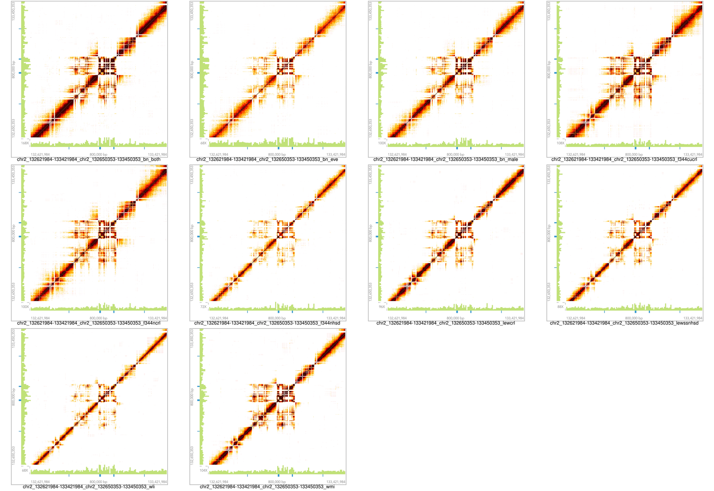

# Saving Matrix View Images From the LOUPE Browser  

The [Loupe browser](https://support.10xgenomics.com/genome-exome/software/visualization/latest/structural-variants) from 10X Genomics is handy for reviewing structural variants from linked-reads libraries. However, there does not appear to be an easy way to compare the same location across many samples. This python script emulates a Firefox browser, loads a set of genomic coordinates and save the matrix view images for a list of samples. 

## Prerequisite: 
* [geckodriver](https://github.com/mozilla/geckodriver/releases) 
* [selenium](https://pypi.org/project/selenium/)

## Usage:
* symlink all your loupe files to the same directory (e.g. /data/loupe_files/)
* export LOUPE_SERVER=/data/loupe_files
* start loupe 
* open the summary page of each sample in your browser and find the unique code for each sample from its URL, which is between "view/" and "/summary":
* put these in the samples dictionary in the python script.
* optionally, you can also change the download dir in the same script; you can change headless to FALSE to have the browser window popup, which can be useful for adjusting the sleep time (wait the image to load)
* review the structural variants and decide on the optimal x-y coordinates and save them in a text file, one per line.
* run the python script to save the image for each set of coordinates across all the samples.
* these images can be compiled into one using the provided shell script.

