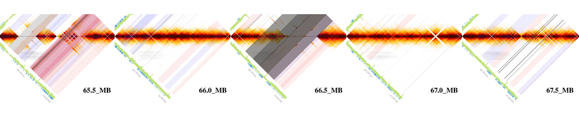

# Saving Matrix View Images From the LOUPE Browser  

The [Loupe browser](https://support.10xgenomics.com/genome-exome/software/visualization/latest/structural-variants) from 10X Genomics is handy for reviewing structural variants from linked-reads libraries. However, there does not appear to be an easy way to work with these images in batch mode. These python and bash scripts emulate a Firefox browser, load a set of genomic coordinates and save the matrix view images in batch mode. 

## Prerequisite: 
* install [geckodriver](https://github.com/mozilla/geckodriver/releases) 
* install [selenium](https://pypi.org/project/selenium/)
* symlink all your loupe files to the same directory (e.g. /data/loupe_files/)
* export LOUPE_SERVER=/data/loupe_files
* start loupe 

### To save the same location from multiple samples and then compile the images
* open the summary page of each sample in your browser and find the unique code for each sample from its URL, which is between "view/" and "/summary":
* put these in the samples dictionary in the python script.
* optionally, you can also change the download dir in the same script; you can change headless to FALSE to have the browser window popup, which can be useful for adjusting the sleep time (wait the image to load)
* review the structural variants and decide on the optimal x-y coordinates and save them in a text file, one per line.
* run the python script to save the image for each set of coordinates across all the samples.
  * save_matrixView_pngs.py
* these images can be compiled into one using the provided shell script.
  * compile_images.sh

### To save all the images from one chromosome, overlay it with structural variants from multiple samples, then rotate the images and compile them 
1. save the images (png)
  * save_matrixView_chr.py
  * find_missing.py (sometimes it crashes and you need to restart. check if you have alll the images)
  * cherrypicking.py (you can download just a few images)
2. get the SVs  
  * vcf2tab.sh (compile all the vcf files, dels.vcf and large_svs.vcf, translocation, i.e. SVTYPE=BND is not processed at the moment)
3. processs the images 
  * overlay_svs.py
  * rotate_compile.sh

Grey: deletions, red: inversions, blue: duplications.  Darker color means more samples have the same calls in the same region.   
